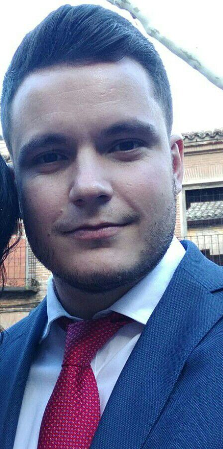

 
 

# Elyoenai Guerra Segura

### Application Development Associate • [ULPGC](https://ulpgc.es)  

----

<i class="fas fa-quote-left fa-2x fa-pull-left fa-border"></i>
"Everybody is a genius. But if you judge a fish by its ability to climb a tree, it will live its whole life believing that it is stupid."  
&nbsp;&nbsp;&nbsp;&nbsp;-Albert Einstein

----

   

Personal Details
---------
&nbsp;&nbsp;&nbsp;elyoenai.guerra@gmail.com

&nbsp;&nbsp;+34 646 512 942

&nbsp;&nbsp;&nbsp;[LinkedIn](https://es.linkedin.com/in/elyoenai-guerra-segura-1217838b)

&nbsp;&nbsp;[GitHub](https://github.com/elyogs)

&nbsp;&nbsp;[Google Scholar](https://scholar.google.com/citations?user=umG6i4AAAAAJ&hl=es)

Experience
----------
2016 - Now
: 	*Application Development Associate*  
	[Accenture Outsourcing Services SA](https://www.accenture.com)  
	Full-time frontend/backend developer

2015
:	*Training in technological development*  
	[Instituto de Astrofísica de Canarias](http://www.iac.es/)  
	Development of a common framework to control the software of the optical equipments

2015
: 	*Research training*  
	[Fundación Universitaria de Las Palmas / Hospital Dr. Negrín](https://www.fulp.es/)  
	[Hospital Universitario de Gran Canaria Dr. Negrín]
	Image processing development 
	
2014 - 2015
:	*Scientific dissemination*  
	[Museo Elder de Ciencia y Tecnología](http://www.museoelder.org/)
	[Fundación Universitaria de Las Palmas / Hospital Dr. Negrín](https://www.fulp.es/)

Education
---------
2016 - Now
:	*PhD Student - EmiTIC: Empresa, Internet y Tecnologías de las Comunicaciones*  
	Focus area: Pattern recognition, signal & image processing, machine learning 
	Universidad de Las Palmas de Gran Canaria (Spain)  

2018 - 2014
:	*Telecommunication Engineer - Master’s Degree*  
	Focus area: Signal & image processing  
	Universidad de Las Palmas de Gran Canaria (Spain)  
	
2015
:	*Master’s Degree - Soluciones TIC para Bienestar y Medioambiente*  
	Focus area: TICs for environment and health
	Universidad de Las Palmas de Gran Canaria (Spain)  

2016
:	*Master’s Degree - Secondary school professor training*  
	Focus area: Technology  
	Universidad de Las Palmas de Gran Canaria (Spain)  

Languages & IT Strengths
------------

:	
	C#, .Net, PHP, Java, Javascript, HTML, CSS, AngularJS, NodeJS, VBScript

:	Selenium (Java, C#, VBScript)

:	Oracle, MySQL, PostreSQL  

:	GIT, Jira

Research career
------
*~*~*

:	*... [Uploading] ...*  

Human Languages
------------
Spanish
:	Native

English
:	Advanced -- 
	Escuela Oficial de Idiomas (B2 certificate)

Awards
------
2016
:	*Best academic records (Telecommunication Engineer - Master’s Degree)*  

2015
:	*Best academic records (Master’s Degree - Soluciones TIC para Bienestar y Medioambiente)*  

------
> Resume available online @ [https://elyogs.github.io/resume](https://elyogs.github.io/resume)